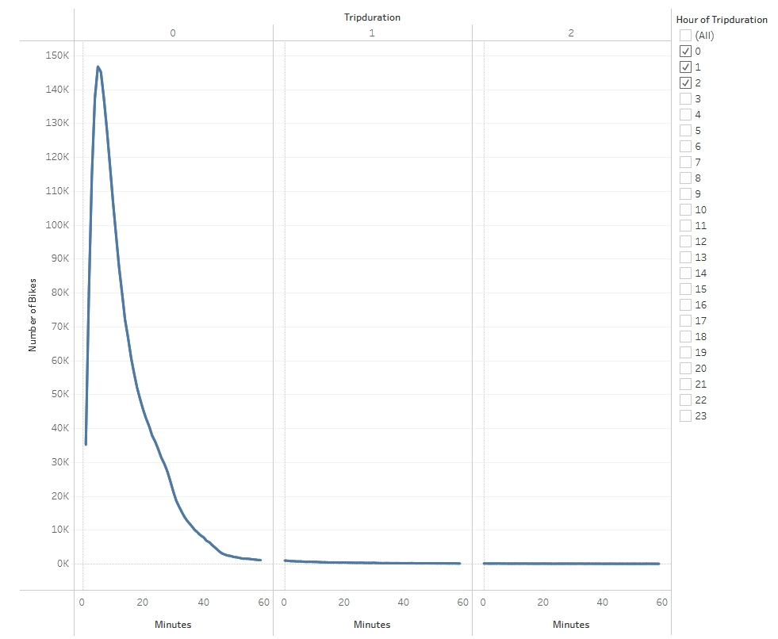
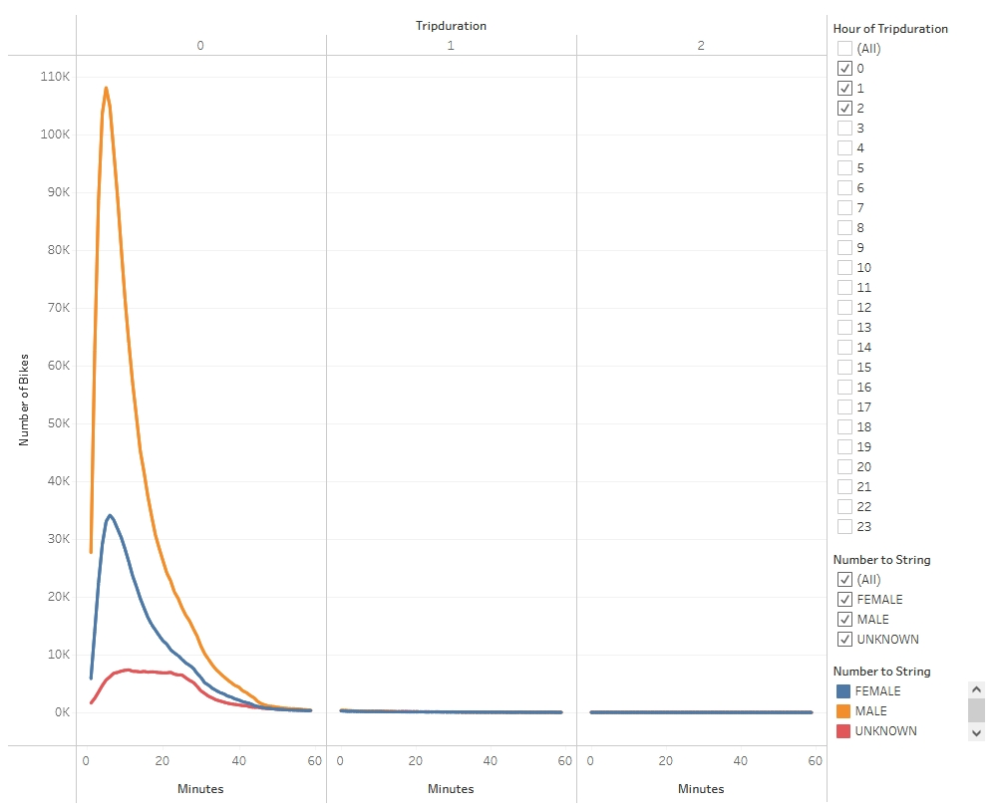

# bikesharing

## Overview Of Analysis

We were asked to do an analysis of the data to look at the August data for NYC CitiBike usage. The end goal is to see if this would be a viable business option for Des Moines. We looked at gender, subscriber type, and various ride types.

## Results:

We created several charts to distill the data:

<b>Checkout Times</b>

There are two views for the amount of time a bike was checked out. The first shows overall, the second breaks it down by gender.

<b>Usage</b>

Next we looked at the overall usage by gender. The graph in the upper left we see the breakdown of trips based off the user being a pay by the ride customer or a subcriber to the bikeshare service. The breakdown shows that more men subscribe to the service than women. The chart next to it shows us the breakdown of what time of day men or women are more likely to be using the service. Once again, men have the highest usage with the bulk of usage being during peak commute times. The final chart at the bottom of this page shows us that overall more men are currently using this service.

<b>Top Starting and Ending Locations</b>

The next set of charts show us the top locations for where a customer picked up the bike vs where they dropped it off. The highest concentrations appear to be in Manhanttan.

<b>Trips by Weekday per Hour</b>

The final chart shows us the overall number of trips for each weekday. From this we can see that the peak hours of usage during the week are commute hours and Sunday seems to be the preferred biking day on the weekends.

The analysis above has been put into a Tableau presentation where the viewer can make changes to the filter criteria (ie: change the hours viewed for checkout time).

[NYC CitiBike Presentation] (https://public.tableau.com/shared/3N5BMDKKH?:display_count=n&:origin=viz_share_link)

## Summary

It's easy to see that bike rentals in NYC during August 2019 were very popular as there were over 2 million trips logged. The population, especially during the week skewed heavily male and subscription based. If Des Moines has the capability for bike friendly lanes to the various businesses, that portion of the business has potential for success. Advertising it as a commute option would be best in that regard.

The weekend usage in NYC shows that there is an interest in leisurly use of the bikes. This is another place where ensuring there are enough proper bike paths to popular sites would benefit the business.

Further investigation on age ranges and delving deeper into how many rentals were tourism based would help target advertising. Also, looking at monthly usage in what is traditionally winter would be helpful. Des Moines has very different winters compared to NYC. You'd need to see if the bikeshare would be purely a seasonal offer with the bikes being stored for the winter months. In that case, bike maintenance could be performed during the off months. But, there would be an additional charge for storing the bikes as well as the logictics necesary to find a storage place.

As long as the differences between NYC and Des Moines can be taken into account, there is a potential of this service being successful in Des Moines.